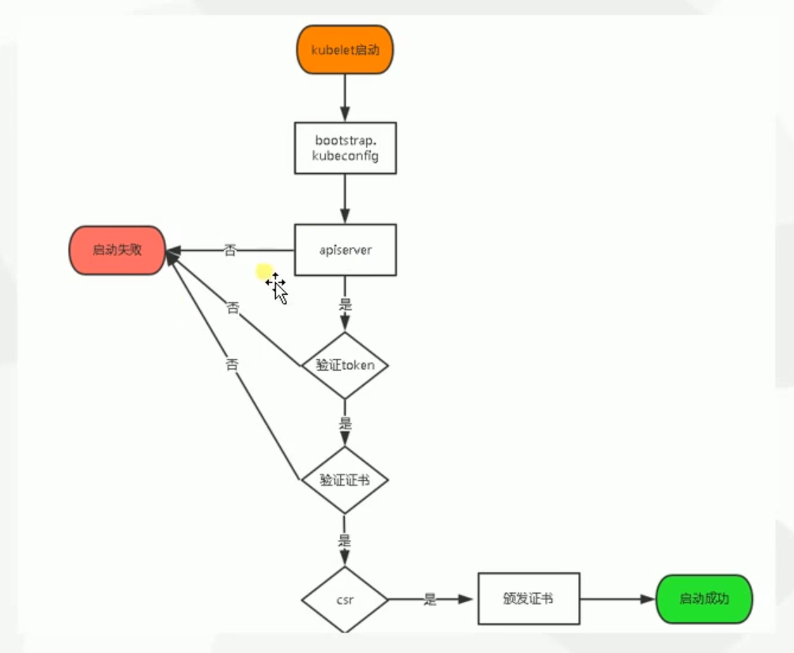

## 集群架构与组件

```shell
# 梳理流程
https://www.jianshu.com/p/bb973ab1029b
```

### 单master架构图


### 用户访问流程图


### 模型对象


## 高可用集群部署

### 部署方式与集群规划

* minikube

  minikube是一个工具, 可以在本地快速运行一个单点的k8s, 仅用于尝试或日常开发的用户使用

  部署地址: https://kubernetes.io/docs/setup/minikube

* kubeadm

  kubeadm也是一个工具, 提供kubeadm和kubeadm join, 用于快速部署k8s集群

  部署地址: https://kubernetes.io/docs/reference/setup-tools/kubeadm/kubeadm

* 二进制包

  推荐, 从官方下载你发行版的二进制包, 手动部署每个组件, 组成k8s集群

  下载地址: https://github.com/kubernetes/kubernetes/releases

### 平台规划


### 单节点集群架构图


### 多节点集群架构图


### 环境搭建并初始化(单节点)

1. 使用vagrant创建3台机器

   boxes和bridge自行修改, bridge不清楚可以删掉
   
   vagrantfile内容见附录: vagrantfile

2. 初始化系统

   ```shell
   # 以下操作均在master机器上
   
   # 关闭selinux
   sudo vi /etc/selinux/config
   SELINUX=disabled
   sudo setenforce 0
   # 关闭防火墙(可选)
   sudo systemctl stop firewalld
   # 修改主机名(重新进入终端)
   sudo vi /etc/hostname
   sudo hostname k8s-master01
   # 同步时间
   sudo yum -y install ntpdate && sudo ntpdate time.windows.com
   # 安装软件
   sudo yum -y install net-tools vim
   ```

3. 生成https证书

   

4. 为etcd自签证书

```shell
# 创建目录
cd 
mkdir k8s && cd k8s
mkdir k8s-cert
mkdir etcd-cert && cd etcd-cert

# 搭建证书生成工具
vi cfssl.sh
# 内容见附录: cfssl.sh
sudo bash cfssl.sh

# 生成证书
vi etcd-cert.sh
# 内容见附录: etcd-cert.sh
sudo bash etcd-cert.sh
```

5. 安装etcd

```shell
# 下载etcd
# 其它版本: https://github.com/etcd-io/etcd/releases
curl -L -O https://github.com/etcd-io/etcd/releases/download/v3.3.13/etcd-v3.3.13-linux-amd64.tar.gz
# 解压
tar -zxvf etcd-v3.3.13-linux-amd64.tar.gz
# 移动到指定目录
sudo mkdir -p /opt/etcd/{cfg,bin,ssl}
cd etcd-v3.3.13-linux-amd64
sudo mv etcd etcdctl /opt/etcd/bin/
# 部署启动脚本
cd ~/k8s/
vi etcd.sh
## 内容见附录: etcd.sh
chmod +x etcd.sh

# 拷贝证书
sudo cp ~/k8s/etcd-cert/{ca,server-key,server}.pem /opt/etcd/ssl/

# 执行部署脚本
sudo ./etcd.sh etcd01 192.168.1.30 etcd02=https://192.168.1.31:2380,etcd03=https://192.168.1.32:2380

# 查看日志
## 发现正在等待连接其它两个节点, 而此时其它节点我们还没有部署
sudo tail /var/log/messages -f

# 部署另外连个节点(在node1和node2上执行)
## 因为虚拟机是vagrant创建的, 外部是无法通过密码访问ssh的, 需要修改配置
## vagrant用户的默认密码是vagrant
sudo vi /etc/ssh/sshd_config
PasswordAuthentication yes
sudo systemctl restart sshd

# master上执行(分别发送到node1和node2)
sudo scp -r /opt/etcd/ vagrant@192.168.1.31:~/etcd/
sudo scp -r /usr/lib/systemd/system/etcd.service vagrant@192.168.1.31:~
# node1和node2
vagrant ssh node1
sudo cp -r etcd /opt/etcd/
sudo cp etcd.service /usr/lib/systemd/system/etcd.service
sudo vi /opt/etcd/cfg/etcd
## 修改ip地址成本机ip: ETCD_NAME ETCD_LISTEN_PEER_URLS ETCD_LISTEN_CLIENT_URLS ETCD_INITIAL_ADVERTISE_PEER_URLS ETCD_ADVERTISE_CLIENT_URLS
sudo systemctl daemon-reload
sudo systemctl enable etcd
sudo systemctl restart etcd

# master验证集群是否搭建成功
## 创建命令别名
sudo touch /opt/etcd/bin/my_etcdctl
sudo chown vagrant /opt/etcd/bin/my_etcdctl
sudo chmod 0744 /opt/etcd/bin/my_etcdctl
cat > /opt/etcd/bin/my_etcdctl <<EOF
#!/bin/bash
/opt/etcd/bin/etcdctl --ca-file=/opt/etcd/ssl/ca.pem --cert-file=/opt/etcd/ssl/server.pem --key-file=/opt/etcd/ssl/server-key.pem --endpoints="https://192.168.1.30:2379,https://192.168.1.31:2379,https://192.168.1.32:2379" \$@
EOF
sudo /opt/etcd/bin/my_etcdctl cluster-health
```

### node安装docker

```shell
# 安装必要的系统工具
sudo yum install -y yum-utils device-mapper-persistent-data lvm2
# 添加软件源信息
sudo yum-config-manager --add-repo http://mirrors.aliyun.com/docker-ce/linux/centos/docker-ce.repo
# 更新并安装 Docker-CE
sudo yum makecache fast
sudo yum -y install docker-ce
# 镜像加速器(https://www.daocloud.io/mirror)
curl -sSL https://get.daocloud.io/daotools/set_mirror.sh | sh -s http://f1361db2.m.daocloud.io
# 重启docker
sudo systemctl restart docker
```

### 网络模型(CNI)

```shell
#常用的网络模型: flannel 或 calico 或 Contiv
# 我们使用Flannel ---- 基于overlay网络

# 部署Flannel
## 给master的flannel分配子网
sudo /opt/etcd/bin/my_etcdctl set /coreos.com/network/config '{"Network": "172.17.0.0/16", "Backend": {"Type": "vxlan"}}'
# 查看分配情况
sudo /opt/etcd/bin/my_etcdctl get /coreos.com/network/config
# 下载二进制包(node节点上)
## https://github.com/coreos/flannel/releases
cd /home/vagrant
curl -OL https://github.com/coreos/flannel/releases/download/v0.11.0/flannel-v0.11.0-linux-amd64.tar.gz
mkdir flannel-v0.11.0-linux-amd64
cd flannel-v0.11.0-linux-amd64
tar -zxvf ../flannel-v0.11.0-linux-amd64.tar.gz
sudo mkdir -p /opt/kubernetes/{bin,cfg,ssl}
sudo mv flanneld mk-docker-opts.sh /opt/kubernetes/bin/
# 部署与配置flannel(node节点上)
cd /home/vagrant
vi flannel.sh
## 内容见附录: flannel.sh
## systemd管理Flannel
## 配置Docker使用Flannel生成子网
## 启动Flannel
chmod a+x flannel.sh
sudo ./flannel.sh https://192.168.1.30:2379,https://192.168.1.31:2379,https://192.168.1.32:2379

# 验证安装
ps -ef |grep doc
## 出现： --bip=172.17.59.1/24
ip addr
## docker0与flannal处于同一网段
sudo /opt/etcd/bin/my_etcdctl ls /coreos.com/network


# 验证通信环境是否良好
# 1. 检查node1节点是否可以访问node2上的容器
## node2
docker run -it busybox
ip addr
## node1
ping node2的容器的ip地址
# 2. 检查node1节点的容器是否可以访问node2上的容器
## node1
docker run -it busybox
ip addr
## node1
ping node2的容器的ip地址
```

### 部署master组件

```shell
# kube-apiserver
# kube-controller-manager
# kube-scheduler

#----------------------部署kube-apiserver-------------------------
## https://github.com/kubernetes/kubernetes/releases
## 点击 CHANGELOG-1.15.md for details -> server binaries
# master节点运行
# 下载
cd ~/soft
curl -OL https://dl.k8s.io/v1.15.0/kubernetes-server-linux-amd64.tar.gz
tar -zxvf kubernetes-server-linux-amd64.tar.gz
# 安装
sudo mkdir -p /opt/kubernetes/{bin,cfg,ssl}
cd ~/soft/kubernetes/server/bin
sudo cp kube-apiserver kube-controller-manager kube-scheduler /opt/kubernetes/bin
# 部署安装脚本
cd ~/k8s
vi apiserver.sh
## 内容见附录: apiserver.sh
vi controller-manager.sh
## 内容见附录: controller-manager.sh
vi scheduler.sh
## 内容见附录: scheduler.sh
chmod a+x apiserver.sh controller-manager.sh scheduler.sh

# 环境准备
## 生成证书
cd /home/vagrant/k8s/k8s-cert
vi k8s-cert.sh
## 内容见附录: k8s-cert.sh
chmod a+x k8s-cert.sh
sudo bash k8s-cert.sh
sudo cp ca.pem ca-key.pem server.pem server-key.pem /opt/kubernetes/ssl/


## 生成token文件
### 创建 TLS Bootstrapping Token
#BOOTSTRAP_TOKEN=$(head -c 16 /dev/urandom | od -An -t x | tr -d ' ')
BOOTSTRAP_TOKEN=0fb61c46f8991b718eb38d27b605b008
cat > token.csv <<EOF
${BOOTSTRAP_TOKEN},kubelet-bootstrap,10001,"system:kubelet-bootstrap"
EOF
sudo mv token.csv /opt/kubernetes/cfg/

# 安装脚本
sudo mkdir /opt/kubernetes/logs
sudo ./apiserver.sh 192.168.1.30 https://192.168.1.30:2379,https://192.168.1.31:2379,https://192.168.1.32:2379

# 查看是否启动
ps -ef |grep kube

## ps: 如果出现问题, 手动排查问题
### source /opt/kubernetes/cfg/kube-apiserver
### /opt/kubernetes/bin/kube-apiserver $KUBE_APISERVER_OPTS

### 更多参数配置：
### https://feisky.gitbooks.io/kubernetes/components/apiserver.html

#-------------------部署kube-controller-manager-------------------
sudo ./controller-manager.sh 127.0.0.1

#-------------------部署kube-scheduler-------------------
sudo ./scheduler.sh 127.0.0.1

#-------------------------查看集群状态------------------------------
sudo cp ~/soft/kubernetes/server/bin/kubectl /usr/bin/
kubectl get cs
```

### 部署node组件



```shell
#---------------------------master机子上操作--------------------
# 将kubelet-bootstrap用户绑定到系统集群角色
## 与 cat /opt/kubernetes/cfg/token.csv
kubectl create clusterrolebinding kubelet-bootstrap \
--clusterrole=system:node-bootstrapper \
--user=kubelet-bootstrap
### 删除是kubectl delete clusterrolebinding kubelet-bootstrap

# 创建kubeconfig文件
vi ~/k8s/kubeconfig.sh
## 内容见附录: kubeconfig.sh
sudo bash kubeconfig.sh 192.168.1.30 ~/k8s/k8s-cert
## 检查user的token是否存在
sudo cat bootstrap.kubeconfig
## 拷贝到node机器上
sudo scp bootstrap.kubeconfig kube-proxy.kubeconfig vagrant@192.168.1.31:~/
sudo scp /home/vagrant/soft/kubernetes/server/bin/{kubelet,kube-proxy} vagrant@192.168.1.31:~/

#---------------------------在node机器上执行--------------------
sudo cp bootstrap.kubeconfig kube-proxy.kubeconfig /opt/kubernetes/cfg/
sudo cp kubelet kube-proxy /opt/kubernetes/bin/
# 部署kubelet, kube-proxy组件
vi ~/kubelet.sh
## 内容见附录: kubelet.sh
sudo mkdir /opt/kubernetes/logs
sudo bash kubelet.sh 192.168.1.31
sudo systemctl restart kubelet
## 排错
sudo ps -aux|grep kubelet
less /var/log/messages
tail -f /var/log/messages
less /opt/kubernetes/logs/kubelet.INFO

# 把节点加入集群(master)
sudo kubectl get csr
sudo kubectl certificate approve csr-字符串
sudo kubectl get node

vi ~/proxy.sh
## 内容见附录: proxy.sh
sudo bash proxy.sh 192.168.1.31
sudo ps -aux |grep proxy

# 从node1拷贝到node2
## 查找 （grep 31 *）
sudo scp -r /opt/kubernetes/ vagrant@192.168.1.32:/opt/
sudo scp /usr/lib/systemd/system/{kubelet,kube-proxy}.service vagrant@192.168.1.32:/usr/lib/systemd/system/
sudo rm -rf /opt/kubernetes/ssl/*
cd /opt/kubernetes/cfg
sudo vim kubelet ## 修改ip192.168.1.31为192.168.1.32
sudo vim kubelet.config ## 修改ip192.168.1.31为192.168.1.32
sudo vim kube-proxy ## 修改ip192.168.1.31为192.168.1.32
sudo systemctl daemon-reload
sudo systemctl restart kube-proxy
sudo systemctl restart kubelet
## master手动颁发证书
sudo kubectl get csr
sudo kubectl certificate approve csr-字符串
sudo kubectl get node
```

### 部署一个测试示例

```shell
# 下载pods
sudo kubectl run nginx --image=nginx
# 查看pods
sudo kubectl get pods
sudo kubectl get all
# 暴露端口
sudo kubectl expose deployment nginx --port=80 --target-port=80 --type=NodePort
# 查看端口
sudo kubectl get svc
# 尝试访问
curl 10.0.0.12:80

# 如果失败， 确保flannel运行正常
ifconfig # 查看docker/flannel1是否在同一个网段
ps -aux |grep flanneld
sudo systemctl status flanneld
sudo systemctl restart flanneld
sudo systemctl restart docker

sudo tail -f /var/log/messages

# master
sudo kubectl get pods -o wide
sudo kubectl get svc
sudo kubectl get pods
sudo kubectl logs pos-name

# node1和node2
sudo vim /opt/kubernetes/cfg/kubelet.config
authentication:
  anonymous:
    enabled: true
sudo systemctl restart kubelet
sudo ps -ef |grep kubelet
```


<https://edu.51cto.com//center/course/lesson/index?id=319528>


## 附录: etcd-cert.sh

```shell
export PATH=$PATH:/usr/local/bin
cat > ca-config.json <<EOF
{
  "signing": {
    "default": {
      "expiry": "87600h"
    },
    "profiles": {
      "www": {
         "expiry": "87600h",
         "usages": [
            "signing",
            "key encipherment",
            "server auth",
            "client auth"
        ]
      }
    }
  }
}
EOF

cat > ca-csr.json <<EOF
{
    "CN": "etcd CA",
    "key": {
        "algo": "rsa",
        "size": 2048
    },
    "names": [
        {
            "C": "CN",
            "L": "Beijing",
            "ST": "Beijing"
        }
    ]
}
EOF

cfssl gencert -initca ca-csr.json | cfssljson -bare ca -

#-----------------------

cat > server-csr.json <<EOF
{
    "CN": "etcd",
    "hosts": [
    "192.168.1.30",
    "192.168.1.31",
    "192.168.1.32"
    ],
    "key": {
        "algo": "rsa",
        "size": 2048
    },
    "names": [
        {
            "C": "CN",
            "L": "BeiJing",
            "ST": "BeiJing"
        }
    ]
}
EOF

cfssl gencert -ca=ca.pem -ca-key=ca-key.pem -config=ca-config.json -profile=www server-csr.json | cfssljson -bare server

```


```shell
export PATH=$PATH:/usr/local/bin
cat > ca-config.json <<EOF
{
  "signing": {
    "default": {
      "expiry": "87600h"
    },
    "profiles": {
      "www": {
         "expiry": "87600h",
         "usages": [
            "signing",
            "key encipherment",
            "server auth",
            "client auth"
        ]
      }
    }
  }
}
EOF

cat > ca-csr.json <<EOF
{
    "CN": "etcd CA",
    "key": {
        "algo": "rsa",
        "size": 2048
    },
    "names": [
        {
            "C": "CN",
            "L": "Beijing",
            "ST": "Beijing"
        }
    ]
}
EOF

cfssl gencert -initca ca-csr.json | cfssljson -bare ca -

#-----------------------

cat > server-csr.json <<EOF
{
    "CN": "etcd",
    "key": {
        "algo": "rsa",
        "size": 2048
    },
    "names": [
        {
            "C": "CN",
            "L": "BeiJing",
            "ST": "BeiJing"
        }
    ]
}
EOF

cfssl gencert -ca=ca.pem -ca-key=ca-key.pem -config=ca-config.json -profile=www server-csr.json | cfssljson -bare server

```

## 附录: vagrantfile

```shell
# -*- mode: ruby -*-
# vi: set ft=ruby :

Vagrant.require_version ">= 1.6.0"

boxes = [
    {
        :name => "swarm-manager",
        :eth1 => "192.168.1.30",
        :mem => "1024",
        :cpu => "1"
    },
    {
        :name => "swarm-worker1",
        :eth1 => "192.168.1.31",
        :mem => "1024",
        :cpu => "1"
    },
    {
        :name => "swarm-worker2",
        :eth1 => "192.168.1.32",
        :mem => "1024",
        :cpu => "1"
    }
]

Vagrant.configure(2) do |config|

  config.vm.box = "centos/7"
  boxes.each do |opts|
      config.vm.define opts[:name] do |config|
        config.vm.hostname = opts[:name]
        config.vm.provider "vmware_fusion" do |v|
          v.vmx["memsize"] = opts[:mem]
          v.vmx["numvcpus"] = opts[:cpu]
        end

        config.vm.provider "virtualbox" do |v|
          v.customize ["modifyvm", :id, "--memory", opts[:mem]]
          v.customize ["modifyvm", :id, "--cpus", opts[:cpu]]
        end

        config.vm.network "public_network", ip: opts[:eth1], bridge: "Realtek PCIe GBE Family Controller"
      end
  end

  config.vm.synced_folder "./labs", "/home/vagrant/labs"
  config.vm.provision "shell", privileged: true, path: "./setup.sh"

end
```

## 附录: cfssl.sh

```shell
curl -L https://pkg.cfssl.org/R1.2/cfssl_linux-amd64 -o /usr/local/bin/cfssl
curl -L https://pkg.cfssl.org/R1.2/cfssljson_linux-amd64 -o /usr/local/bin/cfssljson
curl -L https://pkg.cfssl.org/R1.2/cfssl-certinfo_linux-amd64 -o /usr/local/bin/cfssl-certinfo
chmod +x /usr/local/bin/cfssl /usr/local/bin/cfssljson /usr/local/bin/cfssl-certinfo
```

## 附录: etcd.sh

```shell
#!/bin/bash
# example: ./etcd.sh etcd01 192.168.1.10 etcd02=https://192.168.1.11:2380,etcd03=https://192.168.1.12:2380

ETCD_NAME=$1
ETCD_IP=$2
ETCD_CLUSTER=$3

WORK_DIR=/opt/etcd

cat <<EOF >$WORK_DIR/cfg/etcd
#[Member]
ETCD_NAME="${ETCD_NAME}"
ETCD_DATA_DIR="/var/lib/etcd/default.etcd"
ETCD_LISTEN_PEER_URLS="https://${ETCD_IP}:2380"
ETCD_LISTEN_CLIENT_URLS="https://${ETCD_IP}:2379"

#[Clustering]
ETCD_INITIAL_ADVERTISE_PEER_URLS="https://${ETCD_IP}:2380"
ETCD_ADVERTISE_CLIENT_URLS="https://${ETCD_IP}:2379"
ETCD_INITIAL_CLUSTER="etcd01=https://${ETCD_IP}:2380,${ETCD_CLUSTER}"
ETCD_INITIAL_CLUSTER_TOKEN="etcd-cluster"
ETCD_INITIAL_CLUSTER_STATE="new"
EOF

cat <<EOF >/usr/lib/systemd/system/etcd.service
[Unit]
Description=Etcd Server
After=network.target
After=network-online.target
Wants=network-online.target

[Service]
Type=notify
EnvironmentFile=${WORK_DIR}/cfg/etcd
ExecStart=${WORK_DIR}/bin/etcd \
--name=\${ETCD_NAME} \
--data-dir=\${ETCD_DATA_DIR} \
--listen-peer-urls=\${ETCD_LISTEN_PEER_URLS} \
--listen-client-urls=\${ETCD_LISTEN_CLIENT_URLS},http://127.0.0.1:2379 \
--advertise-client-urls=\${ETCD_ADVERTISE_CLIENT_URLS} \
--initial-advertise-peer-urls=\${ETCD_INITIAL_ADVERTISE_PEER_URLS} \
--initial-cluster=\${ETCD_INITIAL_CLUSTER} \
--initial-cluster-token=\${ETCD_INITIAL_CLUSTER_TOKEN} \
--initial-cluster-state=new \
--cert-file=${WORK_DIR}/ssl/server.pem \
--key-file=${WORK_DIR}/ssl/server-key.pem \
--peer-cert-file=${WORK_DIR}/ssl/server.pem \
--peer-key-file=${WORK_DIR}/ssl/server-key.pem \
--trusted-ca-file=${WORK_DIR}/ssl/ca.pem \
--peer-trusted-ca-file=${WORK_DIR}/ssl/ca.pem
Restart=on-failure
LimitNOFILE=65536

[Install]
WantedBy=multi-user.target
EOF

systemctl daemon-reload
systemctl enable etcd
systemctl restart etcd


```

## 附录: flannel.sh

```shell
#!/bin/bash

ETCD_ENDPOINTS=${1:-"http://127.0.0.1:2379"}

cat <<EOF >/opt/kubernetes/cfg/flanneld

FLANNEL_OPTIONS="--etcd-endpoints=${ETCD_ENDPOINTS} \
-etcd-cafile=/opt/etcd/ssl/ca.pem \
-etcd-certfile=/opt/etcd/ssl/server.pem \
-etcd-keyfile=/opt/etcd/ssl/server-key.pem"

EOF

cat <<EOF >/usr/lib/systemd/system/flanneld.service
[Unit]
Description=Flanneld overlay address etcd agent
After=network-online.target network.target
Before=docker.service

[Service]
Type=notify
EnvironmentFile=/opt/kubernetes/cfg/flanneld
ExecStart=/opt/kubernetes/bin/flanneld --ip-masq \$FLANNEL_OPTIONS
ExecStartPost=/opt/kubernetes/bin/mk-docker-opts.sh -k DOCKER_NETWORK_OPTIONS -d /run/flannel/subnet.env
Restart=on-failure

[Install]
WantedBy=multi-user.target

EOF

cat <<EOF >/usr/lib/systemd/system/docker.service

[Unit]
Description=Docker Application Container Engine
Documentation=https://docs.docker.com
After=network-online.target firewalld.service
Wants=network-online.target

[Service]
Type=notify
EnvironmentFile=/run/flannel/subnet.env
ExecStart=/usr/bin/dockerd \$DOCKER_NETWORK_OPTIONS
ExecReload=/bin/kill -s HUP \$MAINPID
LimitNOFILE=infinity
LimitNPROC=infinity
LimitCORE=infinity
TimeoutStartSec=0
Delegate=yes
KillMode=process
Restart=on-failure
StartLimitBurst=3
StartLimitInterval=60s

[Install]
WantedBy=multi-user.target

EOF

systemctl daemon-reload
systemctl enable flanneld
systemctl restart flanneld
systemctl restart docker


```

## 附录: apiserver.sh

```shell
#!/bin/bash

MASTER_ADDRESS=$1
ETCD_SERVERS=$2

cat <<EOF >/opt/kubernetes/cfg/kube-apiserver

KUBE_APISERVER_OPTS="--logtostderr=false \\
--log-dir=/opt/kubernetes/logs \\
--v=4 \\
--etcd-servers=${ETCD_SERVERS} \\
--bind-address=${MASTER_ADDRESS} \\
--secure-port=6443 \\
--advertise-address=${MASTER_ADDRESS} \\
--allow-privileged=true \\
--service-cluster-ip-range=10.0.0.0/24 \\
--enable-admission-plugins=NamespaceLifecycle,LimitRanger,ServiceAccount,ResourceQuota,NodeRestriction \\
--authorization-mode=RBAC,Node \\
--kubelet-https=true \\
--enable-bootstrap-token-auth \\
--token-auth-file=/opt/kubernetes/cfg/token.csv \\
--service-node-port-range=30000-50000 \\
--tls-cert-file=/opt/kubernetes/ssl/server.pem  \\
--tls-private-key-file=/opt/kubernetes/ssl/server-key.pem \\
--client-ca-file=/opt/kubernetes/ssl/ca.pem \\
--service-account-key-file=/opt/kubernetes/ssl/ca-key.pem \\
--etcd-cafile=/opt/etcd/ssl/ca.pem \\
--etcd-certfile=/opt/etcd/ssl/server.pem \\
--etcd-keyfile=/opt/etcd/ssl/server-key.pem"

EOF

cat <<EOF >/usr/lib/systemd/system/kube-apiserver.service
[Unit]
Description=Kubernetes API Server
Documentation=https://github.com/kubernetes/kubernetes

[Service]
EnvironmentFile=-/opt/kubernetes/cfg/kube-apiserver
ExecStart=/opt/kubernetes/bin/kube-apiserver \$KUBE_APISERVER_OPTS
Restart=on-failure

[Install]
WantedBy=multi-user.target
EOF

systemctl daemon-reload
systemctl enable kube-apiserver
systemctl restart kube-apiserver

```

## 附录: controller-manager.sh

```shell
#!/bin/bash

MASTER_ADDRESS=$1

cat <<EOF >/opt/kubernetes/cfg/kube-controller-manager


KUBE_CONTROLLER_MANAGER_OPTS="--logtostderr=true \\
--v=4 \\
--master=${MASTER_ADDRESS}:8080 \\
--leader-elect=true \\
--address=127.0.0.1 \\
--service-cluster-ip-range=10.0.0.0/24 \\
--cluster-name=kubernetes \\
--cluster-signing-cert-file=/opt/kubernetes/ssl/ca.pem \\
--cluster-signing-key-file=/opt/kubernetes/ssl/ca-key.pem  \\
--root-ca-file=/opt/kubernetes/ssl/ca.pem \\
--service-account-private-key-file=/opt/kubernetes/ssl/ca-key.pem \\
--experimental-cluster-signing-duration=87600h0m0s"

EOF

cat <<EOF >/usr/lib/systemd/system/kube-controller-manager.service
[Unit]
Description=Kubernetes Controller Manager
Documentation=https://github.com/kubernetes/kubernetes

[Service]
EnvironmentFile=-/opt/kubernetes/cfg/kube-controller-manager
ExecStart=/opt/kubernetes/bin/kube-controller-manager \$KUBE_CONTROLLER_MANAGER_OPTS
Restart=on-failure

[Install]
WantedBy=multi-user.target
EOF

systemctl daemon-reload
systemctl enable kube-controller-manager
systemctl restart kube-controller-manager

```

## 附录: scheduler.sh

```shell
#!/bin/bash

MASTER_ADDRESS=$1

cat <<EOF >/opt/kubernetes/cfg/kube-scheduler

KUBE_SCHEDULER_OPTS="--logtostderr=true \\
--v=4 \\
--master=${MASTER_ADDRESS}:8080 \\
--leader-elect"

EOF

cat <<EOF >/usr/lib/systemd/system/kube-scheduler.service
[Unit]
Description=Kubernetes Scheduler
Documentation=https://github.com/kubernetes/kubernetes

[Service]
EnvironmentFile=-/opt/kubernetes/cfg/kube-scheduler
ExecStart=/opt/kubernetes/bin/kube-scheduler \$KUBE_SCHEDULER_OPTS
Restart=on-failure

[Install]
WantedBy=multi-user.target
EOF

systemctl daemon-reload
systemctl enable kube-scheduler
systemctl restart kube-scheduler

```

## 附录： k8s-cert.sh

```shell
export PATH=$PATH:/usr/local/bin
cat > ca-config.json <<EOF
{
  "signing": {
    "default": {
      "expiry": "87600h"
    },
    "profiles": {
      "kubernetes": {
         "expiry": "87600h",
         "usages": [
            "signing",
            "key encipherment",
            "server auth",
            "client auth"
        ]
      }
    }
  }
}
EOF

cat > ca-csr.json <<EOF
{
    "CN": "kubernetes",
    "key": {
        "algo": "rsa",
        "size": 2048
    },
    "names": [
        {
            "C": "CN",
            "L": "Beijing",
            "ST": "Beijing",
      	    "O": "k8s",
            "OU": "System"
        }
    ]
}
EOF

cfssl gencert -initca ca-csr.json | cfssljson -bare ca -

#-----------------------
# 要修改10.206开始的ip, 除了node节点不需要添加到ip列表里面，
# 其它的master、Load Balancer、Registry等都ip都要加上

cat > server-csr.json <<EOF
{
    "CN": "kubernetes",
    "hosts": [
      "10.0.0.1",
      "127.0.0.1",
      "192.168.1.30",
      "192.168.1.31",
      "192.168.1.32",
      "192.168.1.33",
      "192.168.1.34",
      "192.168.1.35",
      "192.168.1.36",
      "kubernetes",
      "kubernetes.default",
      "kubernetes.default.svc",
      "kubernetes.default.svc.cluster",
      "kubernetes.default.svc.cluster.local"
    ],
    "key": {
        "algo": "rsa",
        "size": 2048
    },
    "names": [
        {
            "C": "CN",
            "L": "BeiJing",
            "ST": "BeiJing",
            "O": "k8s",
            "OU": "System"
        }
    ]
}
EOF

cfssl gencert -ca=ca.pem -ca-key=ca-key.pem -config=ca-config.json -profile=kubernetes server-csr.json | cfssljson -bare server

#-----------------------

cat > admin-csr.json <<EOF
{
  "CN": "admin",
  "hosts": [],
  "key": {
    "algo": "rsa",
    "size": 2048
  },
  "names": [
    {
      "C": "CN",
      "L": "BeiJing",
      "ST": "BeiJing",
      "O": "system:masters",
      "OU": "System"
    }
  ]
}
EOF

cfssl gencert -ca=ca.pem -ca-key=ca-key.pem -config=ca-config.json -profile=kubernetes admin-csr.json | cfssljson -bare admin

#-----------------------

cat > kube-proxy-csr.json <<EOF
{
  "CN": "system:kube-proxy",
  "hosts": [],
  "key": {
    "algo": "rsa",
    "size": 2048
  },
  "names": [
    {
      "C": "CN",
      "L": "BeiJing",
      "ST": "BeiJing",
      "O": "k8s",
      "OU": "System"
    }
  ]
}
EOF

cfssl gencert -ca=ca.pem -ca-key=ca-key.pem -config=ca-config.json -profile=kubernetes kube-proxy-csr.json | cfssljson -bare kube-proxy

```

## 附录: kubeconfig.sh

```shell
APISERVER=$1
SSL_DIR=$2
BOOTSTRAP_TOKEN=0fb61c46f8991b718eb38d27b605b008

# 创建kubelet bootstrapping kubeconfig 
export KUBE_APISERVER="https://$APISERVER:6443"

# 设置集群参数
kubectl config set-cluster kubernetes \
  --certificate-authority=$SSL_DIR/ca.pem \
  --embed-certs=true \
  --server=${KUBE_APISERVER} \
  --kubeconfig=bootstrap.kubeconfig

# 设置客户端认证参数
kubectl config set-credentials kubelet-bootstrap \
  --token=${BOOTSTRAP_TOKEN} \
  --kubeconfig=bootstrap.kubeconfig

# 设置上下文参数
kubectl config set-context default \
  --cluster=kubernetes \
  --user=kubelet-bootstrap \
  --kubeconfig=bootstrap.kubeconfig

# 设置默认上下文
kubectl config use-context default --kubeconfig=bootstrap.kubeconfig

#----------------------

# 创建kube-proxy kubeconfig文件

kubectl config set-cluster kubernetes \
  --certificate-authority=$SSL_DIR/ca.pem \
  --embed-certs=true \
  --server=${KUBE_APISERVER} \
  --kubeconfig=kube-proxy.kubeconfig

kubectl config set-credentials kube-proxy \
  --client-certificate=$SSL_DIR/kube-proxy.pem \
  --client-key=$SSL_DIR/kube-proxy-key.pem \
  --embed-certs=true \
  --kubeconfig=kube-proxy.kubeconfig

kubectl config set-context default \
  --cluster=kubernetes \
  --user=kube-proxy \
  --kubeconfig=kube-proxy.kubeconfig

kubectl config use-context default --kubeconfig=kube-proxy.kubeconfig
```

## 附录: kubelet.sh

```shell
#!/bin/bash

NODE_ADDRESS=$1
DNS_SERVER_IP=${2:-"10.0.0.2"}

cat <<EOF >/opt/kubernetes/cfg/kubelet

KUBELET_OPTS="--logtostderr=false \\
--log-dir=/opt/kubernetes/logs \\
--v=4 \\
--address=${NODE_ADDRESS} \\
--hostname-override=${NODE_ADDRESS} \\
--kubeconfig=/opt/kubernetes/cfg/kubelet.kubeconfig \\
--experimental-bootstrap-kubeconfig=/opt/kubernetes/cfg/bootstrap.kubeconfig \\
--config=/opt/kubernetes/cfg/kubelet.config \\
--cert-dir=/opt/kubernetes/ssl \\
--pod-infra-container-image=registry.cn-hangzhou.aliyuncs.com/google-containers/pause-amd64:3.0"

EOF

cat <<EOF >/opt/kubernetes/cfg/kubelet.config

kind: KubeletConfiguration
apiVersion: kubelet.config.k8s.io/v1beta1
address: ${NODE_ADDRESS}
port: 10250
cgroupDriver: cgroupfs
clusterDNS:
- ${DNS_SERVER_IP} 
clusterDomain: cluster.local.
failSwapOn: false

EOF

cat <<EOF >/usr/lib/systemd/system/kubelet.service
[Unit]
Description=Kubernetes Kubelet
After=docker.service
Requires=docker.service

[Service]
EnvironmentFile=/opt/kubernetes/cfg/kubelet
ExecStart=/opt/kubernetes/bin/kubelet \$KUBELET_OPTS
Restart=on-failure
KillMode=process

[Install]
WantedBy=multi-user.target
EOF

systemctl daemon-reload
systemctl enable kubelet
systemctl restart kubelet
```

## 附录: proxy.sh

```shell
#!/bin/bash

NODE_ADDRESS=$1

cat <<EOF >/opt/kubernetes/cfg/kube-proxy

KUBE_PROXY_OPTS="--logtostderr=true \\
--v=4 \\
--hostname-override=${NODE_ADDRESS} \\
--cluster-cidr=10.0.0.0/24 \\
--proxy-mode=ipvs \\
--kubeconfig=/opt/kubernetes/cfg/kube-proxy.kubeconfig"

EOF

cat <<EOF >/usr/lib/systemd/system/kube-proxy.service
[Unit]
Description=Kubernetes Proxy
After=network.target

[Service]
EnvironmentFile=-/opt/kubernetes/cfg/kube-proxy
ExecStart=/opt/kubernetes/bin/kube-proxy \$KUBE_PROXY_OPTS
Restart=on-failure

[Install]
WantedBy=multi-user.target
EOF

systemctl daemon-reload
systemctl enable kube-proxy
systemctl restart kube-proxy
```

## 单机版？?

```shell
https://www.missshi.cn/api/view/blog/5b0e8af013d85b22bc000001
```


